# Game Learn Mode — System Architecture

> How the agent pipeline generates lesson content, converts it to interactive animations, and exposes the learning library to an application.

---

## 1. System Overview

The platform is built around three layers: a **curriculum definition**, an **agent pipeline**, and a **learning library** of static files that any app can serve directly.

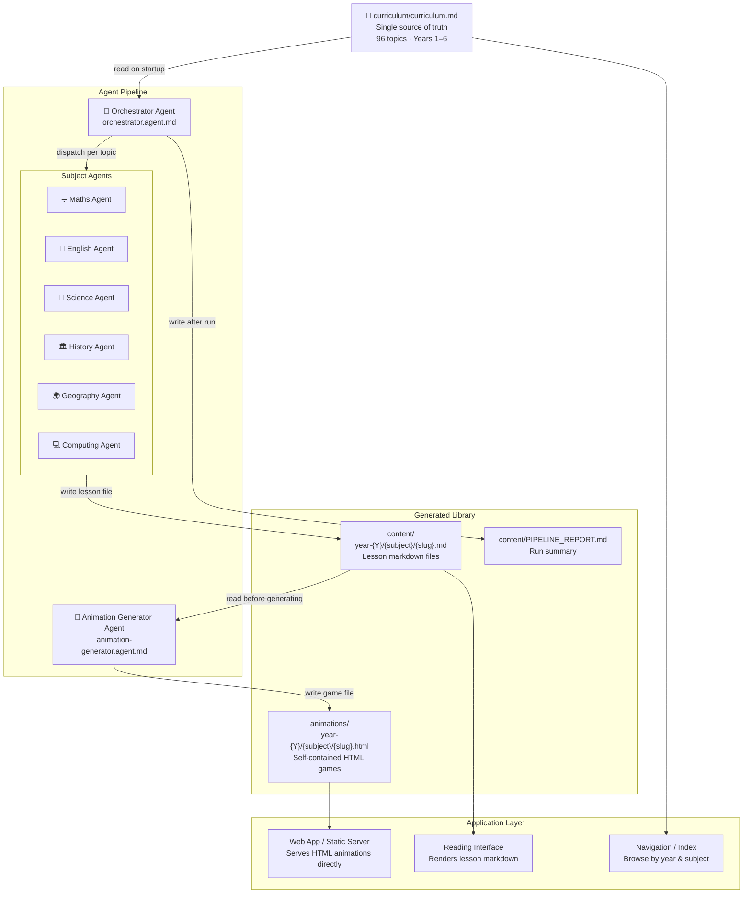

---

## 2. Curriculum Structure

The curriculum markdown is the **only** file agents are allowed to read as their input definition. It encodes every year, subject, topic, slug, and key concepts in one place.

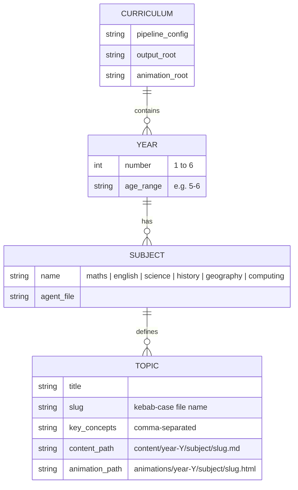

### Topic count by year and subject

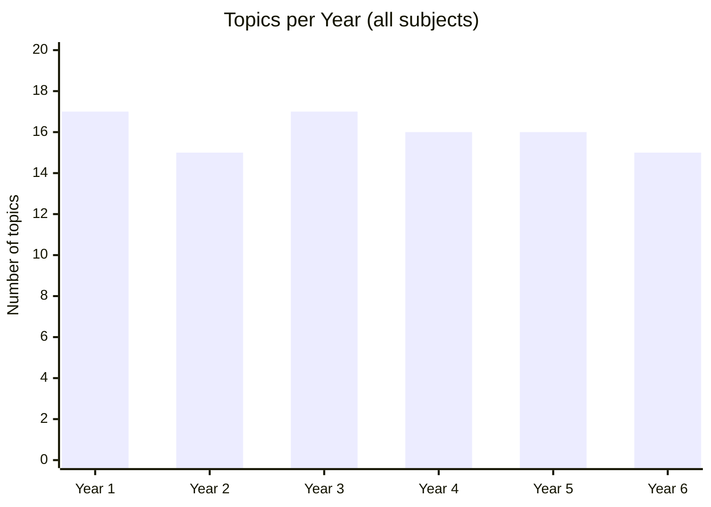

---

## 3. Orchestrator Loop

The orchestrator is the entry point for the entire pipeline. It reads the curriculum, builds a task list, and loops through every topic — dispatching a subject agent then an animation agent for each one.

```mermaid
flowchart TD
    START(["`**Start**
    @orchestrator generate all content`"])
    READ["Read curriculum/curriculum.md\nExtract all topics into flat list"]
    TODO["Build TodoWrite task list\nOne entry per topic"]
    LOOP{{"For each topic\nin the list"}}

    CHECK{"content_path\nAND animation_path\nalready exist?"}
    SKIP["Mark todo done\nSkip to next"]

    DISPATCH_S["Dispatch Subject Agent\n— pass year, subject, topic_title,\nslug, key_concepts, output_file"]
    WAIT_S{{"Wait for\nDONE: {content_path}"}  }
    ERR_S["Log error\nMark todo BLOCKED\nContinue to next topic"]

    DISPATCH_A["Dispatch Animation Generator Agent\n— pass content_file, output_file"]
    WAIT_A{{"Wait for\nDONE: {animation_path}"}}
    ERR_A["Log error\nMark todo BLOCKED\nContinue to next topic"]

    DONE["Mark todo done\n✅ Both files written"]

    MORE{"More topics?"}
    REPORT["Write content/PIPELINE_REPORT.md\nTopics processed · Files written\nErrors · File tree"]
    END([End])

    START --> READ --> TODO --> LOOP
    LOOP --> CHECK
    CHECK -->|"yes (no --force)"| SKIP
    CHECK -->|"no"| DISPATCH_S
    DISPATCH_S --> WAIT_S
    WAIT_S -->|"success"| DISPATCH_A
    WAIT_S -->|"error"| ERR_S
    DISPATCH_A --> WAIT_A
    WAIT_A -->|"success"| DONE
    WAIT_A -->|"error"| ERR_A
    DONE --> MORE
    ERR_S --> MORE
    ERR_A --> MORE
    SKIP --> MORE
    MORE -->|"yes"| LOOP
    MORE -->|"no"| REPORT --> END
```

### Scope filtering

The orchestrator accepts optional filters so you can regenerate a subset without touching the full library:

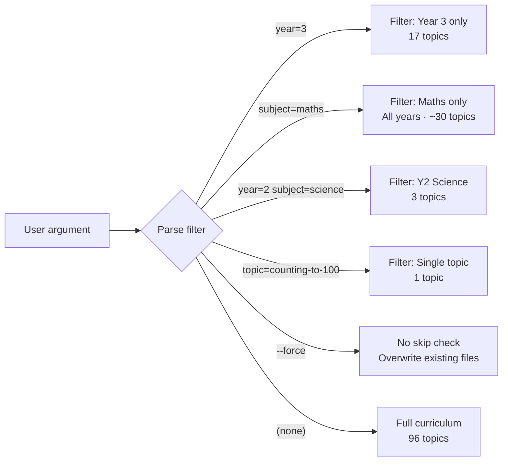

---

## 4. Content Generation Pipeline

Each subject agent receives a task prompt from the orchestrator and writes a single markdown lesson file. Every agent follows the same input/output contract.

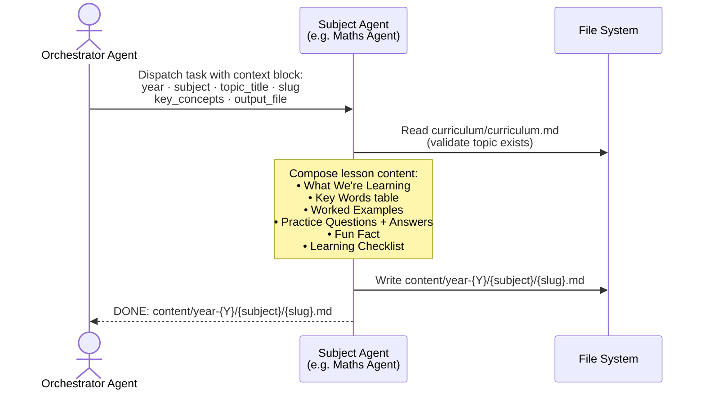

### Lesson file anatomy

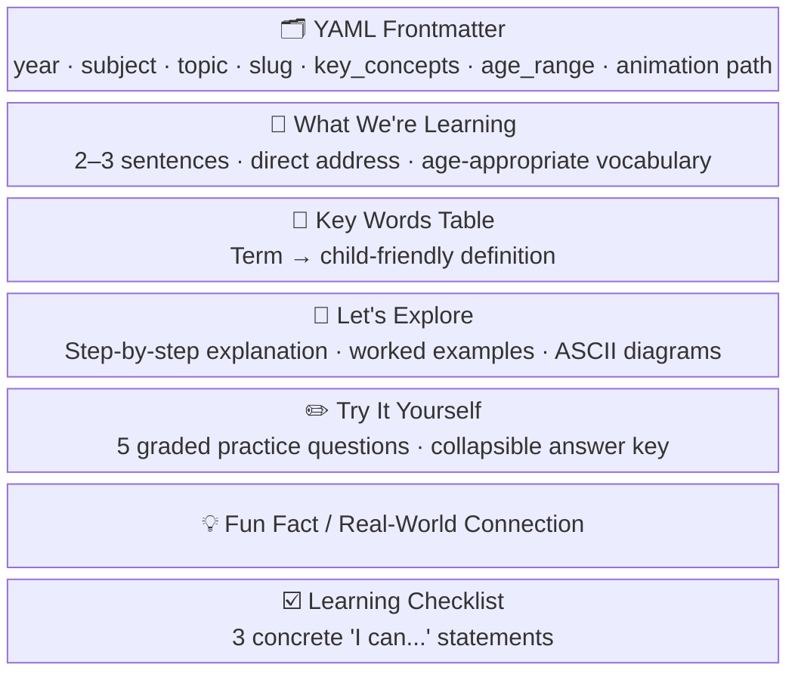

### Subject agent specialisations

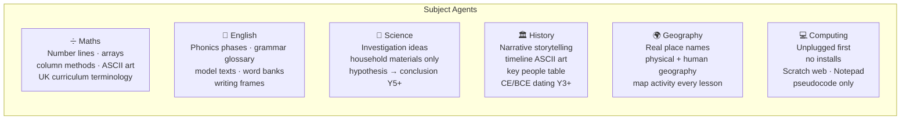

---

## 5. Animation Generation Pipeline

After the content file is written, the orchestrator dispatches the animation generator agent. This agent reads the content, picks the best interaction archetype for the subject and year, and writes a fully self-contained HTML file.

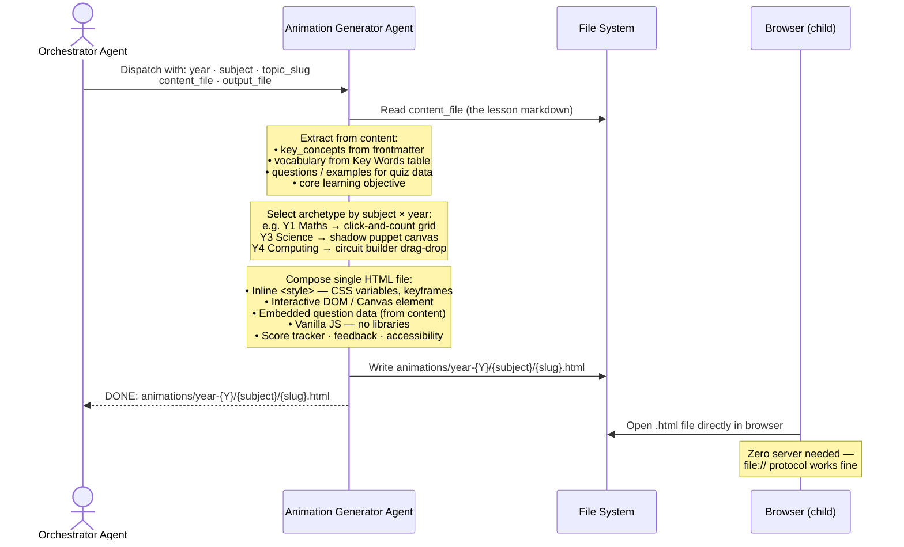

### Animation archetype selection

```mermaid
flowchart TD
    READ["Read content file\nExtract: year · subject · topic type"]

    READ --> MATHS{"Subject\n= Maths?"}
    READ --> ENG{"Subject\n= English?"}
    READ --> SCI{"Subject\n= Science?"}
    READ --> HIST{"Subject\n= History?"}
    READ --> GEO{"Subject\n= Geography?"}
    READ --> COMP{"Subject\n= Computing?"}

    MATHS -->|"Y1–2 counting"| A1["🔢 Click-and-count grid\n100-square with 4 game modes"]
    MATHS -->|"Y1–2 shapes"| A2["🔷 Shape sorter\ndrag shapes to outlines"]
    MATHS -->|"Y3–4 multiplication"| A3["✖️ Array builder\nclick rows/cols, see product"]
    MATHS -->|"Y3–4 fractions"| A4["🍕 Pizza slicer\nclick to divide animated shape"]
    MATHS -->|"Y4–5 place value"| A5["🃏 Number machine\ndrag digit cards to columns"]
    MATHS -->|"Y5–6 statistics"| A6["📊 Bar chart builder\nclick +/- to change bars"]

    ENG -->|"Y1–2 phonics"| B1["🔤 Word builder\nclick phoneme tiles to blend"]
    ENG -->|"Y3–4 grammar"| B2["🗂️ Word class sorter\ndrag to noun/verb/adjective buckets"]
    ENG -->|"Y3–4 punctuation"| B3["❓ Punctuation placer\nclick correct mark for sentence"]

    SCI -->|"Y1–2 body/plants"| C1["🏷️ Label the diagram\ndrag labels to parts"]
    SCI -->|"Y3–4 light"| C2["🔦 Shadow puppet simulator\ncanvas — drag object, shadow updates live"]
    SCI -->|"Y4 electricity"| C3["⚡ Circuit builder\ndrag components, bulb lights when complete"]
    SCI -->|"Y5 solar system"| C4["🪐 Orbit simulator\nplanets animate, click for facts"]

    HIST -->|"All years"| D1["⏳ Timeline drag\ndrag events to correct position"]
    HIST -->|"Y3–6"| D2["🃏 True/False quiz\nflipping cards with explanations"]

    GEO -->|"Y1–2 maps"| E1["🗺️ Map maker\nclick to place landmarks on grid"]
    GEO -->|"Y2–3 continents"| E2["🌍 Continent click quiz\nworld outline, click regions"]
    GEO -->|"Y5–6 climate"| E3["🌡️ Climate zone explorer\nclick zone, scene animates"]

    COMP -->|"Y1–2 algorithms"| F1["🤖 Robot programmer\narrow buttons, grid path"]
    COMP -->|"Y5–6 binary"| F2["💡 Binary decoder\ntoggle bits, decimal updates live"]
```

### HTML file anatomy (every animation)

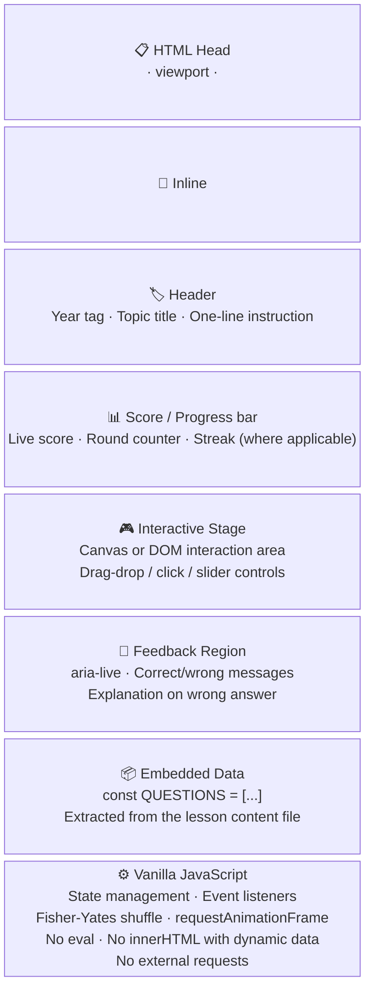

---

## 6. File Naming and Path Conventions

Every file in the system is named by a consistent pattern derived from the curriculum slug.

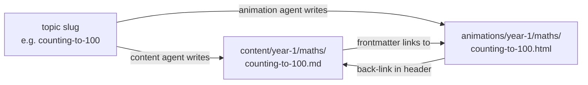

### Directory layout

```
game-learn-mode/
│
├── curriculum/
│   └── curriculum.md              ← source of truth (read-only at runtime)
│
├── .github/
│   └── agents/                    ← GitHub Copilot agent definitions
│       ├── orchestrator.agent.md      ← entry point
│       ├── maths-agent.agent.md
│       ├── english-agent.agent.md
│       ├── science-agent.agent.md
│       ├── history-agent.agent.md
│       ├── geography-agent.agent.md
│       ├── computing-agent.agent.md
│       ├── animation-generator.agent.md
│       └── animation-designer.agent.md
│
├── content/                       ← generated lesson markdown
│   ├── PIPELINE_REPORT.md
│   └── year-{1..6}/
│       └── {subject}/
│           └── {slug}.md
│
├── animations/                    ← generated HTML games
│   └── year-{1..6}/
│       └── {subject}/
│           └── {slug}.html
│
└── doc/
    └── architecture.md            ← this file
```

---

## 7. Exposing Content to an Application

The generated library is **entirely static**. No build step, no server-side rendering, no database. An application consumes it in one of three ways:

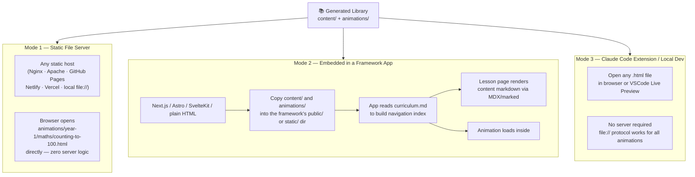

### Recommended integration pattern (Framework App)

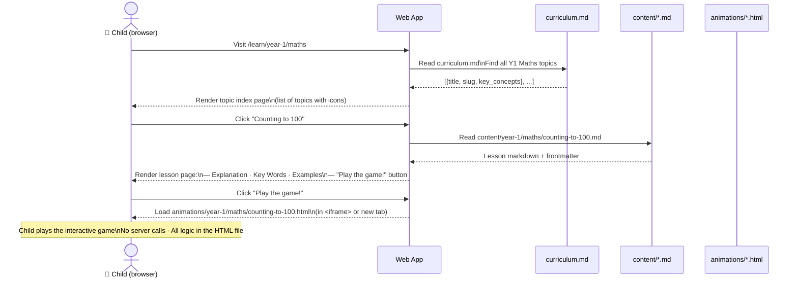

### iframe embedding pattern

```html
<!-- In your app's lesson page template -->
<iframe
  src="/animations/year-1/maths/counting-to-100.html"
  title="Counting to 100 interactive game — Year 1 Maths"
  width="100%"
  style="border:none; border-radius:16px; aspect-ratio:4/3;"
  loading="lazy"
  sandbox="allow-scripts"
></iframe>
```

> **Security note:** The `sandbox="allow-scripts"` attribute is sufficient because all animation files are fully self-contained — they make no external network requests, use no `localStorage`, and contain no user-generated content.

---

## 8. End-to-End Data Flow Summary

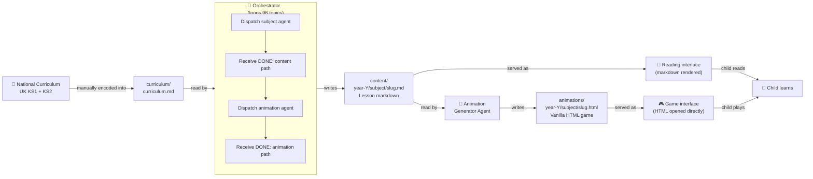

---

## 9. Agent Responsibilities Summary

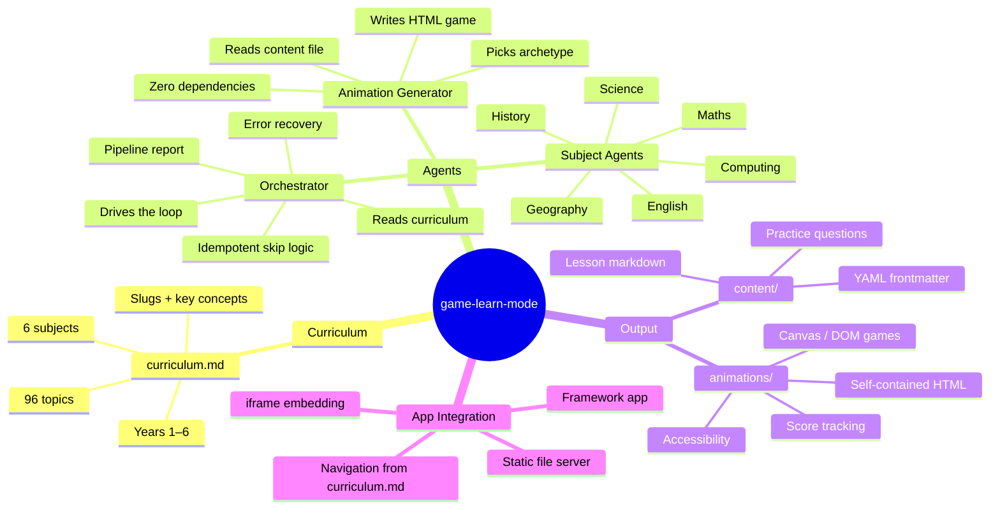

---

## 10. Security and Dependency Policy

All generated files are subject to these hard constraints — enforced in every agent's system prompt:

| Rule | Reason |
|---|---|
| No external `<script src>` or `<link href>` | No CDN dependency risk, works offline, no supply chain exposure |
| No `fetch` / `XMLHttpRequest` in animations | Games run in `sandbox="allow-scripts"` iframes; no data leaves the page |
| No `eval()` or `new Function()` | Prevents code injection vectors |
| `textContent` only for dynamic text (never `innerHTML`) | Prevents XSS even if data were somehow user-influenced |
| No `localStorage` / `sessionStorage` | Children share devices; no cross-session data leakage |
| No npm packages, no build tools | Zero dependency surface; any file is readable and auditable as-is |
| Investigation materials: household items only | Science experiments are safe for unsupervised classroom use |
| `sandbox="allow-scripts"` iframe attribute | Host app gets an extra defence layer when embedding animations |
