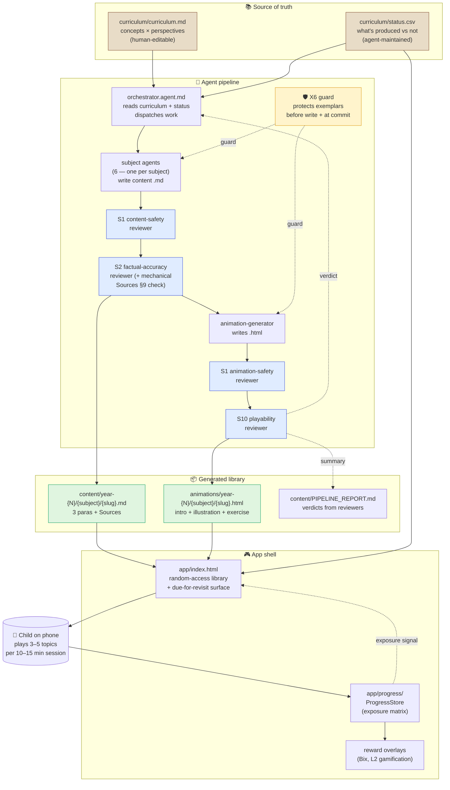
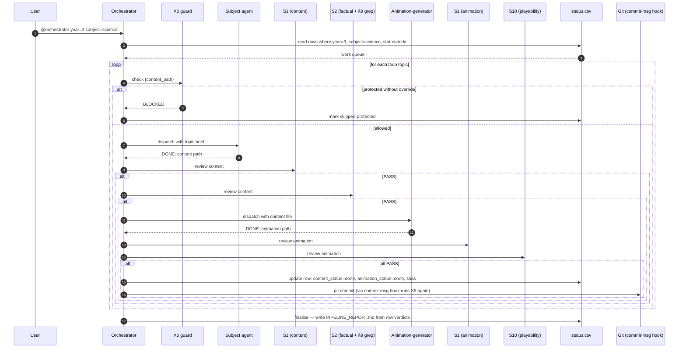
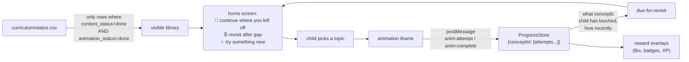

# Architecture — Game Learn Mode

| | |
|---|---|
| **Version** | 2.0 |
| **Date** | 2026-04-23 |
| **Status** | Current (supersedes v1.0 pre-runbook architecture) |
| **Reading order** | [CLAUDE.md](../CLAUDE.md) → this doc → [topic-build-runbook.md](topic-build-runbook.md) |

---

## 1. Intent

**The platform is a cognitive training corpus for a child's developing mind — not a linear curriculum.**

Each topic is a small, self-contained *training example*: a 3-part package (byte-sized description + interactive SVG illustration + visual exercise) that carries one clear signal. Many short encounters, from different perspectives, with spaced revisit. Same mechanism an AI is trained with. Different mechanism from a textbook.

This reframing drives every design decision below.

---

## 2. Top-level flow



Three flows worth tracing:

- **New topic** — orchestrator sees `status.csv` row with `content_status=todo`, dispatches subject agent, chains through reviewers, updates status.csv row to `done` + SHA.
- **Exemplar protected** — X6 guard rejects any write to a protected path unless invocation names `--overwrite-exemplar={slug}`. Works before the write (agent-level) and at commit (hook-level).
- **Child play** — app reads `status.csv` for what's available, queries `ProgressStore` exposure matrix for what's due-for-revisit, serves a mixed set.

---

## 3. Source-of-truth files

### 3.1 `curriculum/curriculum.md` — concepts × perspectives

Human-authored list of what a child in each year should learn. Extended from the simple "topic per area" shape to include **perspective** per topic — which cognitive mode it exercises.

Per row: year, subject, **concept** (e.g. "Rocks"), **perspective** (identify / sort / sequence / compose / apply), topic slug, key concepts.

A single curriculum concept may produce 2–4 topics (one per perspective). Example:

```markdown
## Year 3 — Ages 7–8

### Science

#### Concept: Rocks
| Perspective | Topic | Slug |
|---|---|---|
| Identify  | Rock types          | rock-types |
| Sort      | Rock properties sort | rock-properties-sort |
| Sequence  | How fossils form    | fossil-formation |
| Compose   | What soil is made of | soil-composition |

#### Concept: Plants
| Perspective | Topic | Slug |
|---|---|---|
| Identify  | Parts of a plant    | plants-functions-y3 ✅ |
| Sort      | Plant growth needs  | plant-growth-needs |
| Sequence  | Plant lifecycle     | plant-lifecycle |
```

See [feedback_multiple_perspectives.md](../../../../Users/vaibh/.claude/projects/c--VP-GH-game-learn-mode/memory/feedback_multiple_perspectives.md) (memory) for the framework origin.

### 3.2 `curriculum/status.csv` — production + validation matrix

Agent-maintained. One row per **topic** (not per concept). Columns:

| Column | Meaning |
|---|---|
| `year` | 1–6 |
| `subject` | maths / english / science / history / geography / computing |
| `concept` | Curriculum concept ID (e.g. "rocks", "plants", "forces") |
| `perspective` | identify / sort / sequence / compose / apply |
| `slug` | kebab-case topic slug |
| `content_status` | `todo` / `in-progress` / `done` / `blocked-safety` / `blocked-accuracy` / `blocked-topic` |
| `animation_status` | `todo` / `in-progress` / `done` / `blocked-safety-animation` / `blocked-playability` / `blocked-archetype` |
| `protected` | `yes` / `no` — synced with `tools/protected-exemplars.json` |
| `validated_with_child` | ISO date or empty |
| `last_reviewed` | ISO date (set by the last successful reviewer pass) |
| `content_sha` | SHA-256 of the .md (LF-normalised) — matches X6 manifest when protected |
| `animation_sha` | SHA-256 of the .html — ditto |

Example rows:

```csv
year,subject,concept,perspective,slug,content_status,animation_status,protected,validated_with_child,last_reviewed,content_sha,animation_sha
3,science,plants,identify,plants-functions-y3,done,done,yes,2026-04-23,2026-04-23,2c5e0a81...,171911f6...
3,science,rocks,identify,rocks-fossils,done,done,no,,2026-04-23,...,...
3,science,rocks,sort,rock-properties-sort,todo,todo,no,,,,
3,science,rocks,sequence,fossil-formation,todo,todo,no,,,,
3,science,rocks,compose,soil-composition,todo,todo,no,,,,
3,science,forces,identify,forces-magnets,done,done,no,,2026-04-23,...,...
3,science,light,identify,light-shadows,done,done,no,,2026-04-23,...,...
```

Why CSV, not JSON?
- Human-readable in git diff (essential for trust — this file records the product state).
- Trivially grep-able (`grep ",todo,todo," status.csv` → find all un-produced topics).
- Sorted rows are a stable diff (no JSON key-order drift).
- Spreadsheet-editable if a human wants to bulk-update.

One CSV, not one-per-year. Year is a column; you filter with `awk` or grep.

### 3.3 Topic output files

Each produced topic writes two files, following [topic-build-runbook.md](topic-build-runbook.md):

```
content/year-{N}/{subject}/{slug}.md
  ├── YAML frontmatter (one block)
  ├── 3 paragraphs
  └── ## Sources (≥ 2 citations)

animations/year-{N}/{subject}/{slug}.html
  ├── <style> with inlined V1 tokens + bespoke --c-* illustration colours
  ├── <section class="card intro"> — byte-sized paragraphs
  ├── <section class="card stage"> — tappable SVG illustration
  ├── <section class="card quest"> — 5 rotating prompts + feedback
  ├── <section class="card complete"> — stars + play-again
  └── <script> — PART_INFO + PROMPTS + postMessage hooks
```

Structure is non-negotiable (see runbook §7).

---

## 4. Agent chain — sequence

Every new topic flows through the same chain. X6 guard fires twice: before agent dispatch, and again at commit via the git hook.



Notes:
- X6 runs twice by design. Layer 2 (agent call) catches honest generators; layer 3 (git hook) catches bypass attempts and manual edits.
- Reviewers are separate agents — they NEVER edit files. They return `PASS` / `FAIL` / `BLOCKED`. On `FAIL`, orchestrator re-dispatches the generator with the findings (retry cap: 2). Third failure → row marked `blocked-*`.
- `PIPELINE_REPORT.md` is derived from `status.csv` row verdicts — never self-narrated by the orchestrator. (This closes the integrity gap flagged earlier — commit 9b68269 notes 98/117 files shipped without Sources despite a false PIPELINE_REPORT claim.)

---

## 5. Reviewer gates

| Gate | Scope | Lives in | Key check |
|---|---|---|---|
| **S1 content** | Content .md | [content-safety-reviewer.agent.md](../.github/agents/content-safety-reviewer.agent.md) | Banned topics, tone, imagery, PII. Reads safety-policy §§1–11. |
| **S2 factual** | Content .md | [factual-accuracy-reviewer.agent.md](../.github/agents/factual-accuracy-reviewer.agent.md) | UK National Curriculum alignment + fact check. **Mechanical `grep '^## Sources$'` pre-check** (backlog X5) — zero LLM spend on §9 violations. |
| **S1 animation** | Animation .html | Same agent, different input | No banned imagery, no external URLs, no PII prompts, `prefers-reduced-motion`, no out-of-palette hex literals. |
| **S10 playability** | Animation .html | [playability-reviewer.agent.md](../.github/agents/playability-reviewer.agent.md) | 12-check rubric, year-scaled (see [feature-design-s10-playability.md](feature-design-s10-playability.md)). |
| **X6 exemplar guard** | Any .md or .html | [guard_exemplar.py](../tools/guard_exemplar.py) + [commit-msg hook](../tools/hooks/commit-msg) | Protected paths require explicit `--overwrite-exemplar={slug}`. |

Gates run **in sequence**, not parallel. A BLOCKED on any gate stops the topic; the row in status.csv records which gate blocked it so the human can intervene.

---

## 6. The app shell — library consumption

The app reads `status.csv` and the `ProgressStore` (P3) to decide what to show.



Progress is tracked at **concept level** (not topic level) because the same concept has multiple perspective topics. See [feature-design-progress-gamification.md](feature-design-progress-gamification.md) for the ProgressStore design (pending revision to exposure-matrix model per training-corpus framing).

---

## 7. File tree

```
game-learn-mode/
├── CLAUDE.md                  # agent front door
├── README.md                  # human entry point
├── BACKLOG.md                 # priorities, status
│
├── curriculum/
│   ├── curriculum.md          # source of truth — concepts × perspectives
│   └── status.csv             # production matrix (NEW, per §3.2)
│
├── content/
│   ├── PIPELINE_REPORT.md     # derived from status.csv
│   └── year-{N}/{subject}/{slug}.md
│
├── animations/
│   ├── _shared/
│   │   ├── child-baseline.css # V1 tokens
│   │   ├── archetypes/        # 12 shell templates (A1 backlog)
│   │   └── svg/icons.svg      # V3 backlog
│   └── year-{N}/{subject}/{slug}.html
│
├── app/
│   ├── index.html             # shell, router
│   ├── app.js                 # router, ProgressStore integration
│   ├── styles.css             # shell chrome (separate from child-baseline)
│   ├── curriculum.json        # built from status.csv for client read
│   └── progress/              # P3 reusable module (pending)
│
├── .github/agents/
│   ├── _shared/safety-policy.md
│   ├── orchestrator.agent.md
│   ├── {maths|english|science|history|geography|computing}-agent.agent.md
│   ├── animation-generator.agent.md
│   ├── content-safety-reviewer.agent.md     # S1
│   ├── factual-accuracy-reviewer.agent.md   # S2
│   └── playability-reviewer.agent.md        # S10
│
├── tools/
│   ├── protected-exemplars.json
│   ├── guard_exemplar.py      # X6 CLI
│   ├── install-hooks.sh
│   ├── hooks/
│   │   └── commit-msg         # X6 backstop
│   └── swap-y3-palette.py     # one-off, can archive
│
└── doc/
    ├── architecture.md        # THIS FILE
    ├── topic-build-runbook.md # the method
    ├── ghcp-prompts-y3-science.md
    ├── feature-design-child-visual-standard.md
    ├── feature-design-animation-system.md
    ├── feature-design-progress-gamification.md
    ├── feature-design-s10-playability.md
    ├── feature-design-p0-safety-mobile.md
    └── feature-design-x6-diff-before-regen.md
```

---

## 8. Current state (2026-04-23)

### What runs
- Agent chain producing content + animations under gates
- X6 guard active (manifest + CLI + commit-msg hook) — 1 topic protected
- V1 visual standard landed in `child-baseline.css`
- Runbook referenced from every subject agent + animation-generator + orchestrator

### What's validated with a real child
- 1 topic: `plants-functions-y3` — 7-year-old engaged unprompted

### What's produced but not child-validated
- 3 topics: `forces-magnets`, `light-shadows`, `rocks-fossils` — GHCP-built, passed all mechanical checks, awaiting play-test

### What's pre-methodology vintage
- Years 1, 2, 4, 5, 6 — 98 content files exist but were built before the runbook/visual-standard/gates and don't ship `## Sources`. See backlog X4 (Sources backfill), C4 (retro-review).

### What's planned but not built
- `curriculum/status.csv` — still only curriculum.md (no perspective column, no status tracking). Needs first-pass generation + sync with X6 manifest.
- Perspective extension of curriculum.md — concept × perspective rows instead of flat topic list.
- Progress/ProgressStore module (P3).
- Gamification layer (L2, L6).
- Archetype catalogue (A1) + SVG icon library (V3).
- Bix mascot as reusable SVG (V4).

---

## 9. Links to detailed design

| Topic | Doc |
|---|---|
| **How to build a topic** (runbook) | [topic-build-runbook.md](topic-build-runbook.md) |
| V1 visual standard (palette, type, motion, Bix) | [feature-design-child-visual-standard.md](feature-design-child-visual-standard.md) |
| 12-archetype animation catalogue | [feature-design-animation-system.md](feature-design-animation-system.md) |
| Progress + gamification (P3/L2) | [feature-design-progress-gamification.md](feature-design-progress-gamification.md) |
| S10 playability reviewer | [feature-design-s10-playability.md](feature-design-s10-playability.md) |
| P0 safety + mobile baseline | [feature-design-p0-safety-mobile.md](feature-design-p0-safety-mobile.md) |
| X6 exemplar guard | [feature-design-x6-diff-before-regen.md](feature-design-x6-diff-before-regen.md) |
| Safety policy (§§1–12) | [.github/agents/_shared/safety-policy.md](../.github/agents/_shared/safety-policy.md) |

---

## 10. Change log

| Version | Date | Change |
|---|---|---|
| 1.0 | 2026-04-18 | Initial arch doc — described pre-runbook pipeline with old verbose content shape + quiz-only animations. |
| **2.0** | **2026-04-23** | **Full rewrite.** Training-corpus framing (intent). Adds `curriculum/status.csv` production matrix (§3.2). Pulls all reviewer gates into the flow (§5). Integrates X6 exemplar guard. Removes references to old "Key Words table / Learning Checklist / ASCII art" shape (now forbidden by runbook). Adds file tree + current-state sections. Links to all live design docs. |
