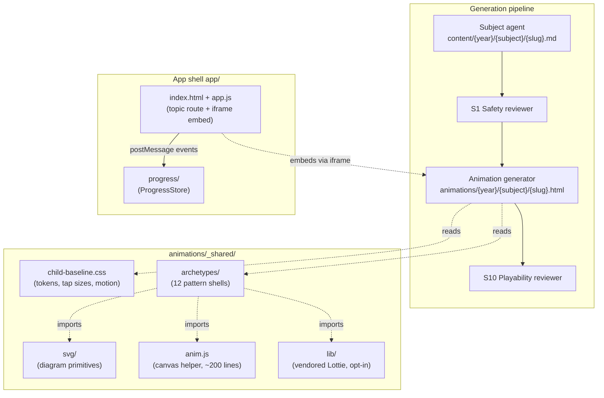

# Feature Design — Animation Generation System

| | |
|---|---|
| **Document** | `doc/feature-design-animation-system.md` |
| **Version** | 1.0 |
| **Date** | 2026-04-19 |
| **Authors** | Vaibhav Pandey (Owner) · Claude Opus 4.7 (AI pair) |
| **Status** | **Draft** — design only, no code yet |
| **Related** | [BACKLOG.md](../BACKLOG.md) (A1–A8, C3, M6) · [feature-design-s10-playability.md](feature-design-s10-playability.md) · [feature-design-progress-gamification.md](feature-design-progress-gamification.md) · [safety-policy.md](../.github/agents/_shared/safety-policy.md) · [child-baseline.css](../animations/_shared/child-baseline.css) |

---

## 1. Summary

Today, every animation on the platform is the same artefact: a 10-question multiple-choice quiz, 4 buttons per question. Phonics, forces-and-magnets, fractions, and phonemes all ship identical shells with a different `QUESTIONS` array. That's a generator problem, not a platform ceiling — vanilla HTML5/CSS/JS can deliver far richer interactions, but the current agent never branches.

This document designs an **archetype-driven animation system**: a small catalogue of interaction patterns, a decision tree that picks the right pattern per topic × year, a shared assets layer (SVG primitives, a tiny canvas helper, optional vendored reward libs), and a retrofit path for the 117 files already on disk.

The system stays inside the existing non-negotiables — no CDNs, no npm, static files, self-contained HTML — but opens a clear, policy-respecting door for *self-hosted* assets when a specific topic benefits from them.

---

## 2. Why a system, not per-topic templates

A per-topic template (copy gold-standard shell, tweak for the topic) gives us what we already have: one pattern, repeated. That's fine for a prototype; it fails at 117 files because it collapses variety under LLM load.

A **catalogue + decision tree** separates two concerns the generator currently conflates:
1. **Interaction pattern** — how the child engages (tap vs drag vs slide vs paint vs reorder).
2. **Content** — what the interaction is *about* (phonics sounds, volcano layers, fraction halves).

With a catalogue, the agent picks a pattern from a short list with explicit year fit and rubric wiring, then instantiates it with topic content. The pattern carries the S10 checks (tap size, instructions, feedback kindness) so every new archetype inherits them for free.

This also unlocks **reusability across apps** — the same catalogue can power a future spelling app, a maths-drills app, or a science-explainer app without re-deriving the interaction layer.

---

## 3. Where animations sit in the application



Animations run **inside an iframe** from the app shell. They're self-contained HTML. They talk back to the shell via `postMessage` events (`topic-viewed`, `attempt-made`, `topic-completed`) that the shell routes into `ProgressStore`. Animations never touch localStorage directly — that keeps the module boundary clean and the iframe sandboxable.

---

## 4. Archetype catalogue

Twelve patterns cover the vast majority of primary-school interactions. Each is a shell in `animations/_shared/archetypes/{id}.html` with a documented contract.

| # | Archetype | One-line | Best for | Year fit | Interaction |
|---|---|---|---|---|---|
| AR1 | **multiple-choice-quiz** | Read a prompt, tap one of 4 answers | Vocab checks, facts, definitions | Y1–Y6 | tap |
| AR2 | **drag-to-match** | Drag items from left column to matching slots on right | Word/picture pairs, label diagrams | Y1–Y6 | drag |
| AR3 | **number-line-slider** | Slide a marker to the correct value on a number line | Counting, estimation, fractions | Y1–Y4 | slide |
| AR4 | **shape-sorter** | Drop shapes into labelled bins | 2D/3D shapes, materials, classification | Y1–Y3 | drag |
| AR5 | **phoneme-tap** | Tap letter tiles in order to build the sound/word | Phonics, spelling | Y1–Y2 | tap sequence |
| AR6 | **volume-pour** | Tilt / tap to fill containers to a target level | Measurement, capacity, fractions | Y1–Y4 | tap / gesture |
| AR7 | **sequence-builder** | Reorder steps to form a correct sequence | Story order, instructions, life cycles, algorithms | Y1–Y6 | drag reorder |
| AR8 | **canvas-paint** | Paint / trace on a canvas to satisfy a condition | Letter formation, shape drawing, symmetry | Y1–Y3 | pointer draw |
| AR9 | **shadow-mover** | Move a light source; watch shadow respond | Light, shadows, time of day | Y3–Y4 | slide |
| AR10 | **force-pull** | Apply a force (drag) and see the object respond | Magnets, friction, gravity | Y3–Y5 | drag + physics |
| AR11 | **fraction-fold** | Fold / shade parts of a shape to match a fraction | Fractions, proportions | Y2–Y5 | tap cells |
| AR12 | **story-reorder** | Reorder sentences / images into narrative order | Story structure, historical sequence | Y1–Y6 | drag reorder |

### 4.1 Archetype shell contract

Every archetype shell must:

- Inline `child-baseline.css` (M2 requirement).
- Expose a top-level `<script>` block with a single `TOPIC` config object the generator fills in:
  ```js
  const TOPIC = {
    title: "…",
    subtitle: "Year {N} {subject}",
    items: [/* archetype-specific payload */],
    feedback: { kind: [...], onWrong: "…", onRight: "…" },
  };
  ```
- Emit `postMessage` events to the parent shell:
  - `{type: "anim:ready"}` on first paint
  - `{type: "anim:attempt", correct: bool, durationMs}` per interaction
  - `{type: "anim:complete", score, total}` at the end
- Respect `prefers-reduced-motion` (inherited from baseline).
- Ship one instructional line at the top (Y1–2 ≤ 10 words; Y3–4 ≤ 25; Y5–6 ≤ 50) per S10 bars.
- Be keyboard operable (tab to every control, Enter/Space to activate, arrow keys where natural).

Shells are **the source of truth for a pattern**. The generator instantiates them — it does not write interaction code from scratch.

---

## 5. Generator decision tree

New step inside [animation-generator.agent.md](../.github/agents/animation-generator.agent.md):

```
1. Read content/{year}/{subject}/{slug}.md.
2. Classify the topic by concept kind:
   - "recall" (vocab, facts)           → AR1 multiple-choice-quiz
   - "pair" (matching, labelling)      → AR2 drag-to-match
   - "magnitude" (counting, estimation)→ AR3 number-line-slider
   - "classify" (sorting into kinds)   → AR4 shape-sorter
   - "sound" (phonics)                 → AR5 phoneme-tap
   - "measure" (capacity, length)      → AR6 volume-pour
   - "sequence" (steps, life cycles)   → AR7 sequence-builder
   - "shape-form" (letters, drawing)   → AR8 canvas-paint
   - "light-geom" (shadows)            → AR9 shadow-mover
   - "force" (magnets, pushes)         → AR10 force-pull
   - "fraction" (parts of whole)       → AR11 fraction-fold
   - "narrative" (stories, history)    → AR12 story-reorder
3. Intersect with year bar: if archetype's year fit excludes the target year,
   fall back to AR1 multiple-choice-quiz (universal baseline).
4. Copy the archetype shell to output_file. Fill TOPIC config.
5. Do not rewrite interaction code. Only change TOPIC payload + title strings.
```

**Rule:** the generator may only **instantiate** an archetype, never invent one. If no archetype fits, it emits `ARCHETYPE_MISMATCH` and the orchestrator marks the topic `blocked-archetype` (S10 BLOCKED verdict, existing path).

**Coverage target:** no single archetype >40% of a year's animations (tracked by A8 coverage report). If AR1 creeps above 40%, it's a signal the classifier is too conservative.

---

## 6. Assets layer

Three self-contained asset folders under `animations/_shared/`. All are optional — an archetype uses what it needs.

### 6.1 `archetypes/` (A1)

One HTML file per archetype. These are the **reference implementations** — gold standard for visual design, a11y, and S10 compliance. Generator copies and fills TOPIC.

### 6.2 `svg/` (A4)

Reusable SVG `<symbol>`s for diagrams:
- `body-parts.svg`, `shadow-geometry.svg`, `volcano-cutaway.svg`, `force-vectors.svg`, `fraction-bars.svg`, `magnet-poles.svg`, `light-ray.svg`, `plant-parts.svg`.

Pure SVG + CSS keyframes — no JS. Referenced by `<use href="svg/body-parts.svg#heart">`. Animations pick what they need.

### 6.3 `anim.js` (A5)

A ~200-line vanilla-JS helper for motion-heavy archetypes (AR6 volume-pour, AR9 shadow-mover, AR10 force-pull). Primitives:
- `tween(from, to, durationMs, easing, onFrame, onDone)` — `requestAnimationFrame` tween, honours `prefers-reduced-motion`.
- `drag(el, { onStart, onMove, onEnd })` — unified pointer/touch drag.
- `sprite(canvas, { x, y, w, h, frames })` — simple sprite draw.

No dependencies. Self-hosted under `animations/_shared/`.

### 6.4 `lib/` (A6 + A7, vendored)

*Optional.* Self-hosted third-party libraries for specific visual payoffs:
- **Lottie-web** (~80KB) for reward moments — level-up burst, badge-earned, topic-completed.
- Nothing else is pre-approved; additions require a safety-policy §7 amendment per-library.

**Policy boundary:** vendored means the file sits in the repo, served from our origin, with an attribution line in `lib/ATTRIBUTIONS.md`. It is *not* a CDN include and *not* an npm install. S1 reviewer check: "references to `animations/_shared/lib/*` are permitted; any `http(s)://` outside the repo still fails."

---

## 7. Integration with the existing pipeline

No new reviewers or orchestrator steps — the archetype system slots into the current chain.

| Pipeline stage | Change |
|---|---|
| Subject agent (content `.md`) | Unchanged. |
| S1 on content | Unchanged. |
| S2 on content | Unchanged. |
| Animation generator | **New classifier step + archetype instantiation.** Cannot write free-form interaction code. |
| S1 on animation | **Policy §7 amended** to allow `animations/_shared/lib/*` references. |
| S10 on animation | Unchanged rubric; archetypes are pre-designed to pass. S10 still runs — the shell is inherited, but the TOPIC payload can still break tap counts or reading load. |

**Retrofit path (A3):** run `@orchestrator year=N --force --content-only` for each year after A1 + A2 land. The existing idempotency + gates ensure bad archetype picks get caught by S10.

---

## 8. Integration with the app shell

### 8.1 Embed contract

Animations are embedded via `<iframe src="animations/year-{N}/{subject}/{slug}.html">` with `sandbox="allow-scripts allow-same-origin"`. Same-origin is required so `postMessage` carries the full event payload.

### 8.2 Event routing to ProgressStore

[app/app.js](../app/app.js) registers a single `message` listener:

```js
window.addEventListener('message', (e) => {
  if (e.origin !== location.origin) return;
  const { type, ...payload } = e.data || {};
  if (type === 'anim:attempt') progressStore.recordQuizAttempt(currentTopic, payload);
  if (type === 'anim:complete') progressStore.markCompleted(currentTopic, payload);
});
```

This keeps the animation dumb and the progress layer authoritative (§5 integration in [feature-design-progress-gamification.md](feature-design-progress-gamification.md)).

### 8.3 Theme propagation

Animations default to their own dark palette (`--bg:#0f172a` …) but may inherit theme tokens from the shell via URL params: `?theme=sunrise&tap=56`. Baseline CSS already reads `--tap-min` / `--tap-primary` from CSS vars, so a theme override is a one-line change.

### 8.4 Reward moments

When ProgressStore emits `levelup` or `badge` events (per gamification design §3.1), the shell can render a Lottie overlay *outside* the iframe — animations don't own celebrations, the app does. That keeps the archetype shells focused on learning.

---

## 9. Retrofit strategy for the 117 existing files

Three-phase rollout:

1. **Land A1 + A2** (catalogue + classifier). No existing files change. New animations generated under the new system.
2. **Spot-check pilot**: regenerate Year 3 (`@orchestrator year=3 --force --content-only`) under the new system. 19 files, fast feedback loop. Compare variety before/after with A8 coverage report.
3. **Full retrofit (A3)**: roll out year-by-year, Y1 → Y2 → Y4 → Y5 → Y6. Each year passes through S1 + S10 freshly. Commit per year.

**Rollback path:** each year's animations live in a single commit; `git revert` restores the old version if a year regresses badly on play-test.

---

## 10. Risks & open questions

| # | Risk / question | Mitigation |
|---|---|---|
| R1 | Archetype classifier picks wrong for ambiguous topics (e.g. "statistics-bar-charts" — is that recall, magnitude, or something else?) | Allow the subject agent to hint an archetype in the content frontmatter (`archetype_hint: number-line-slider`); classifier uses the hint when present |
| R2 | 12 archetypes is too few for the long tail (e.g. music, PE) | Catalogue is extensible; new archetype = new shell file + one classifier row. No generator rewrite needed |
| R3 | Iframe `postMessage` plumbing adds a new failure mode — events dropped, origins mismatched | Ship a `postMessage` contract doc + a test harness that mocks the shell. Progress events are idempotent (`markViewed`, `markCompleted`) so replays are safe |
| R4 | Lottie files look great but drift off-brand | All Lottie assets must be reviewed by S1 for imagery; keep them in `animations/_shared/lib/lottie-assets/` with an explicit allowlist |
| R5 | Variety looks good in demos but plays tests show children confused by different UIs per topic | Test on a cohort of 4 topics × 3 archetypes before full retrofit. If the pattern cost (child has to learn a new UI) exceeds the variety gain, collapse back to fewer archetypes |
| Q1 | Should archetypes be agent-written or human-written? | Human-written reference shells for v1 (quality over automation). Agent only instantiates TOPIC. We can consider agent-written archetypes later once the catalogue stabilises |
| Q2 | Do we need per-subject archetype preferences (e.g. history skews to AR12 story-reorder)? | Not in v1. The classifier is concept-kind-driven, not subject-driven. Revisit if A8 shows a subject dominated by one archetype for the wrong reason |
| Q3 | Where does adaptive difficulty (L5) hook in? | Post-v1. TOPIC payload can include `difficulty: easy\|core\|stretch` variants once L5 lands; archetypes opt in by reading `TOPIC.difficulty` |

---

## 11. Non-goals

- **Runtime authoring** — no in-browser level editor; content ships from `.md` → generator → static HTML.
- **3D / WebGL** — out of scope. Primary school topics don't justify the complexity or perf cost.
- **Game engines** (Phaser, Pixi) — breaks the "static files, no build" promise.
- **CDN includes** — vendored only, ever.
- **Analytics** — the animation emits events; the app decides what to log. No direct telemetry from animations.
- **Audio** — deferred to v2. Web Audio API is on the table but out of scope for v1 to avoid accessibility/consent complications.

---

## 12. Acceptance

### v1 — catalogue + classifier in place
- [ ] `animations/_shared/archetypes/` contains reference shells for AR1–AR12.
- [ ] Each archetype shell passes S10 on a seeded TOPIC payload for its target years.
- [ ] Animation-generator agent updated with the classifier decision tree.
- [ ] Year 3 re-generated under the new system; A8 coverage report shows ≥4 distinct archetypes used across 19 topics (no archetype >40%).

### v2 — asset layer
- [ ] `animations/_shared/svg/` contains at least 8 reusable symbol files.
- [ ] `animations/_shared/anim.js` ships with `tween`, `drag`, `sprite` helpers.
- [ ] Safety-policy §7 amendment landed; S1 reviewer recognises `animations/_shared/lib/*` as permitted.

### v3 — full retrofit
- [ ] All 117 animations regenerated under the archetype system.
- [ ] A8 coverage report run per year — no archetype >40% in any year.
- [ ] Reward Lottie wired to ProgressStore `levelup` / `badge` events in the app shell (outside iframes).

---

## 13. Change log

| Version | Date | Authors | Change |
|---|---|---|---|
| 1.0 | 2026-04-19 | Vaibhav Pandey · Claude Opus 4.7 | Initial design. Archetype catalogue (AR1–AR12), classifier decision tree, asset layer split (archetypes / svg / anim.js / lib), pipeline integration, iframe + postMessage contract with app shell, 3-phase retrofit plan. |
