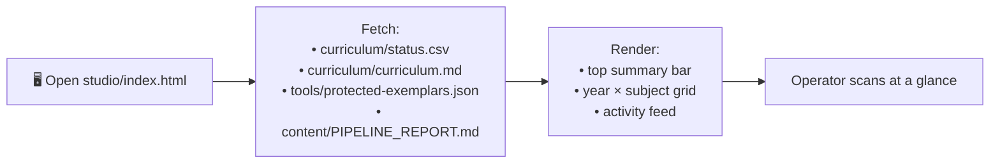
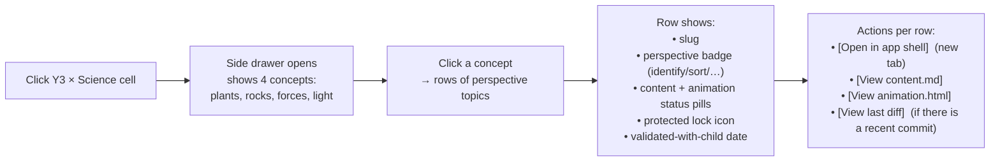
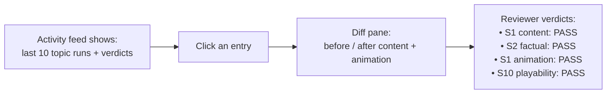

# Feature Design — Content Studio

| | |
|---|---|
| **Document** | `doc/feature-design-content-studio.md` |
| **Version** | 1.0 |
| **Date** | 2026-04-24 |
| **Authors** | Vaibhav Pandey (Owner) · Claude Opus 4.7 (AI pair) |
| **Status** | Draft — v1 spec ready for GHCP build |
| **Related** | [architecture.md](architecture.md) · [topic-build-runbook.md](topic-build-runbook.md) · [feature-design-progress-gamification.md](feature-design-progress-gamification.md) · [BACKLOG.md](../BACKLOG.md) SD1 |

---

## 1. Summary

A **separate, operator-facing application** that makes the existing content-generation architecture (described in [architecture.md](architecture.md)) visible, watchable, and driveable in a browser. It is the **producer tool**; the existing `app/` remains the child-facing product.

It answers one question every few minutes: *"Where is the platform right now — what's done, what's in flight, what's blocked, and is the pipeline producing what it should?"*

Ships as static HTML + JS, same constraints as everything else: no CDNs, no npm, no build step, self-contained. Reads `curriculum/status.csv` and `curriculum/curriculum.md` directly — the existing source-of-truth files.

---

## 2. Why this exists

We have:
- A validated topic-build method (runbook §1–4).
- An agent pipeline with explicit gates (S1/S2/S10 + X6).
- A production matrix as data (`status.csv`).
- Child-validated exemplars driving confidence.

What we **don't** have is a way to *see* any of this without running `python tools/seed_status_csv.py`, reading CSV rows, `grep`-ing git log, and eyeballing `PIPELINE_REPORT.md`. Every operating decision — "what should the child play next?", "which perspective is stuck in review?", "what did GHCP produce today?" — currently requires command-line archaeology.

The studio makes the platform's state the thing on the screen. It also closes the loop on the child-feedback signal: watching a topic get built, seeing its produced files diff against the reference, and triggering a re-build when the child bounces.

---

## 3. Scope — what the studio is and is not

### v1 — read-only dashboard (this doc's main spec)
- Renders platform state from existing data files.
- No triggering of agents; no file writes from the UI.
- Informational only. An operator sees status, opens a topic, reviews diffs, reads reviewer verdicts.

### v1.5 — trigger + visualise (next iteration, briefly sketched in §9)
- "Build this perspective" button writes a task to `studio/queue.json`.
- A separate local runner script (`tools/run-pipeline.py`) polls the queue and dispatches through the existing orchestrator / GHCP.
- Runner writes `studio/run-state.json`; dashboard polls it to animate the pipeline stages in real time.

### v2 — live streaming (out of scope for v1 spec)
- Runner becomes a long-running daemon.
- Server-sent events stream agent output to the dashboard.
- One-click approve / reject / commit from the UI.

### Explicit non-goals
- Not a CMS. We don't edit content inside the studio.
- Not a CI/CD replacement. Git is still the source of truth.
- Not another child-facing surface. The studio is adult/operator; styling differs from the child shell.

---

## 4. User flows (v1)

### 4.1 Entry — "what's the state?"



### 4.2 Drill — "what's happening in Y3 Science?"



### 4.3 Inspect — "what did the last run produce?"



v1 is read-only — the feed is reconstructed from git log + PIPELINE_REPORT.md + a future `studio/activity.json` (v1.5 adds write side).

---

## 5. UI sketch

ASCII mock, rendered in Y3 Science drilled-in state:

```
┌──────────────────────────────────────────────────────────────────────┐
│ Game Learn · Content Studio                            [Sync] [⚙]    │
├──────────────────────────────────────────────────────────────────────┤
│ 120 topics live   · 9 todo   · 4 validated   · last build 2h ago     │
├──────────────────────────────────────────────────────────────────────┤
│        Maths  English  Science  History  Geog   Computing            │
│ Y1     ●●●●●  ●●●●●    ●●●●     ●●       ●●     ●●                    │
│ Y2     ●●●●●  ●●●●●    ●●●      ●●●      ●●     ●●                    │
│ Y3     ●●●●●  ●●●●     ●●●●●●●◐ ●●       ●●     ●●       ← drilled   │
│ Y4     ●●●●●  ●●●●     ●●●●     ●●       ●●     ●●                    │
│ Y5     ●●●●●  ●●●●     ●●●●     ●●       ●●     ●●                    │
│ Y6     ●●●●●  ●●●●     ●●●●     ●●       ●●     ●●                    │
│                                                                        │
│ ● = done    ◐ = todo    🔒 = protected    ✓ = child-validated          │
├──────────────────────────────────────────────────────────────────────┤
│ Y3 · Science · 7 topics live · 9 todo                                 │
│                                                                        │
│   ▸ Plants (1/4 perspectives)                                         │
│     ✅🔒✓ plants-functions-y3         identify   (validated 2026-04-23)│
│     ◐    plant-growth-needs          sort                              │
│     ◐    plant-lifecycle             sequence                          │
│     ◐    water-transport             apply                             │
│                                                                        │
│   ▾ Rocks & Fossils (4/4 perspectives)                                │
│     ✅🔒✓ rocks-fossils               identify   (validated 2026-04-23)│
│     ✅    rock-properties-sort        sort       ⚠ played, child stuck │
│     ✅    fossil-formation            sequence   unplayed              │
│     ✅    soil-composition            compose    unplayed              │
│                                                                        │
│   ▸ Forces & Magnets (1/4 perspectives)                               │
│   ▸ Light & Shadows (1/4 perspectives)                                │
├──────────────────────────────────────────────────────────────────────┤
│ Recent pipeline activity                                              │
│ ●●●●●● 2h ago  · rocks-fossils batch (3 topics) · all PASS            │
│ ●●●●●●  1d ago · Y3 science identify batch (3 topics) · all PASS      │
│ ●●●●●●  4d ago · plants-functions-y3 hand-built · child-validated     │
└──────────────────────────────────────────────────────────────────────┘
```

Key elements:
- **Top summary** — 1-line metrics always visible.
- **Year × Subject grid** — dense, scannable, colour-coded dots for topic status. Click → drilled view.
- **Drilled drawer** — concepts grouped, collapsible, each row a perspective topic.
- **Row badges** — ✅ done, ◐ todo, 🔒 protected, ✓ validated. A concept heading with child-concern (like rock-properties-sort being hard in class) can show a ⚠ banner.
- **Activity feed** — last 10 runs, commit-based, clickable to diff.

---

## 6. Data contracts (what the studio reads)

All read-only fetches in v1. Paths are relative to repo root (served via the existing `python -m http.server` at the repo root).

| Source | Purpose | Format |
|---|---|---|
| `curriculum/status.csv` | Every topic's production + validation state | CSV (architecture.md §3.2 schema) |
| `curriculum/curriculum.md` | Concept + perspective definitions + statutory scope citations | Markdown — parsed client-side enough to extract concept headings |
| `tools/protected-exemplars.json` | Protected slug list + validation metadata | JSON |
| `content/PIPELINE_REPORT.md` | Last run summary (if any) | Markdown — displayed verbatim in the "last run" card |
| `studio/activity.json` (optional) | Pre-computed last-N-commits feed. If absent, activity feed is hidden. | JSON |

The studio **never** fetches from outside the repo. No analytics, no CDN, no third-party.

### Parsing notes

- CSV parsing: 12 columns, first row is the header. Client-side parser is ~30 lines of vanilla JS.
- Markdown parsing for `curriculum.md`: we only need the `## Year N` / `### Subject` / `#### Concept: X` / table rows with slug + perspective. Use a minimal line-based extractor, not a full markdown parser.
- Concept grouping: for Y3 Science, `curriculum.md` has the exploded view. For everything else, fall back to `concept == slug` from status.csv row.

---

## 7. Pipeline-stage visualisation (v1.5 preview)

For v1, the activity feed shows **completed** pipeline stages per commit — reconstructed from commit history + `PIPELINE_REPORT.md`.

For v1.5, the studio adds a **live stage strip** when a run is active:

```
┌───────────────────────────────────────────────────────────────────┐
│ Active: rock-properties-sort  (started 14:22)                      │
│                                                                    │
│  ✅─✅─✅─⏳─□─□─□                                                 │
│  SubjAg  S1  S2  Anim   S1  S10  Done                              │
│                                                                    │
│  Subject agent: wrote content/year-3/science/rock-properties-sort.md │
│  S1 content:    PASS                                               │
│  S2 factual:    PASS                                               │
│  Animation gen: ⏳ generating SVG illustration…                     │
│                                                                    │
│  [View content diff]  [Cancel]                                     │
└───────────────────────────────────────────────────────────────────┘
```

Stage state machine: `queued → subject-agent → s1-content → s2-factual → animation-generator → s1-animation → s10-playability → done | blocked-{reason}`. Same sequence as [architecture.md §4](architecture.md).

The stage strip is driven by `studio/run-state.json`, which the local runner (`tools/run-pipeline.py` — to be specced in v1.5) updates on every stage transition.

---

## 8. File layout

```
studio/
├── index.html         # the dashboard
├── studio.css         # styling (adult operator, not child-facing)
├── studio.js          # single-file vanilla JS — fetch, parse, render, poll
├── README.md          # how to run it, what each panel means
└── data/              # (v1.5+ only — generated/appended by runner)
    ├── activity.json  # last-50 run entries
    ├── queue.json     # pending runs
    └── run-state.json # current run
```

Entry point: `http://localhost:3000/studio/` once `python -m http.server 3000` is running at repo root.

---

## 9. v1.5 — triggering builds from the dashboard

Out of scope for v1 build, but the design must not close this door.

### Flow

```
Dashboard [Rebuild] button
  ↓
POST-like write to studio/data/queue.json (v1.5 requires a small backend — simplest: a Python script serving a /api/queue endpoint OR a workflow that uses the File System Access API in Chrome)
  ↓
tools/run-pipeline.py (long-running local script)
  ↓ reads queue.json, dispatches via orchestrator
  ↓ writes run-state.json on every stage transition
  ↓
Dashboard polls run-state.json every 2s
  ↓ re-renders stage strip live
```

### Why this is v1.5 not v1

- v1 proves the read-side works and is useful on its own.
- Building a long-running runner + client-side write path is a meaningfully different engineering problem from the read-only dashboard.
- Shipping v1 first lets us learn what the operator actually looks at before we automate the trigger side.

---

## 10. Visual standard for the studio

The studio is an **operator tool**, not a child surface. It uses:

- The V1 palette tokens from `animations/_shared/child-baseline.css` (the same warm canvas + semantic colours, for consistency), but:
- Standard `system-ui` font stack, NOT `ui-rounded` — adult readability + data density.
- Tighter type scale: 13–14px body, 11px labels, 18–20px headings. No child `clamp()` scale.
- Denser grid layout — max-width 1200px (not 540px).
- Keyboard-first navigation: Tab/Shift+Tab for cells, Enter/Space to drill, Esc to close drawer.
- No Bix. No celebration animations. No shame-free-feedback concepts — this is a dashboard, not a game.

Dark mode defaults to `data-theme="dark"` for the studio if the OS prefers dark. Child-surface dark is still opt-in; studio dark is auto.

Feedback cues:
- ✅ done (c-success)
- ◐ todo (c-ink-muted)
- 🔒 protected (c-accent)
- ✓ validated (small badge; c-celebrate)
- ⚠ play-test flagged (c-warn)
- ❌ blocked (c-error)

---

## 11. Accessibility

- Full keyboard operable — every interactive element Tab-reachable.
- `aria-live="polite"` on the activity feed.
- Colour never the sole state signal — every status has an icon + text.
- Focus rings visible (3px solid `--c-primary`, same as child shell).
- Respects `prefers-reduced-motion` — grid transitions snap to final state when set.

---

## 12. Risks & open questions

| # | Risk / question | Mitigation |
|---|---|---|
| R1 | `curriculum.md` parser drifts from the actual doc shape as we evolve | Parser is intentionally tolerant — missing headings fall back to slug-as-concept. |
| R2 | Operator triggers a rebuild of a protected exemplar via v1.5 by accident | Runner honours X6 guard — refuses protected paths unless `--overwrite-exemplar={slug}` explicitly passed. |
| R3 | Studio shows stale data because files were updated outside the usual flow | Reload button + "last fetched" timestamp on every panel. |
| Q1 | Should the studio live at repo root or under `studio/`? | `studio/` — keeps it out of the app shell path and easy to gitignore a local-only runner state folder. |
| Q2 | Should v1 show reviewer verdicts per-topic or only per-run? | Per-topic is ideal but requires per-topic verdict files (backlog X3 plans these). For v1, per-run from `PIPELINE_REPORT.md` is enough. |
| Q3 | Mobile support? | Deferred. This is a desktop operator tool. Responsive down to tablet is nice-to-have, not required. |

---

## 13. Acceptance (v1)

- [ ] `studio/index.html` + `studio.css` + `studio.js` + `studio/README.md` exist.
- [ ] Opening `http://localhost:3000/studio/` renders the dashboard with live data from `curriculum/status.csv`.
- [ ] Top summary shows: total live topics, todo count, validated count, last build timestamp (from latest commit touching `animations/` or `content/`).
- [ ] Year × Subject grid renders 6 × 6 cells with status dots coloured per the legend.
- [ ] Clicking a cell opens a drawer listing concepts + perspective topics with correct badges.
- [ ] Protected topics show the 🔒 icon; validated topics show ✓ with date.
- [ ] Activity feed shows last 10 commits touching content/ or animations/ with message + time.
- [ ] Reading is fully keyboard-navigable.
- [ ] No external network calls. No CDNs. All fetches are relative paths under the repo.
- [ ] `python tools/guard_exemplar.py verify` still passes (studio does not touch protected files).

---

## 14. Links

- Architecture (what the studio visualises): [architecture.md](architecture.md)
- Topic-build method: [topic-build-runbook.md](topic-build-runbook.md)
- X6 guard contract: [feature-design-x6-diff-before-regen.md](feature-design-x6-diff-before-regen.md)
- Progress tracking (future integration): [feature-design-progress-gamification.md](feature-design-progress-gamification.md)
- GHCP prompt to build v1: [ghcp-prompt-content-studio.md](ghcp-prompt-content-studio.md)

---

## 15. Change log

| Version | Date | Authors | Change |
|---|---|---|---|
| 1.0 | 2026-04-24 | Vaibhav Pandey · Claude Opus 4.7 | Initial design — v1 read-only dashboard spec + sketch of v1.5 trigger + v2 live streaming. |
