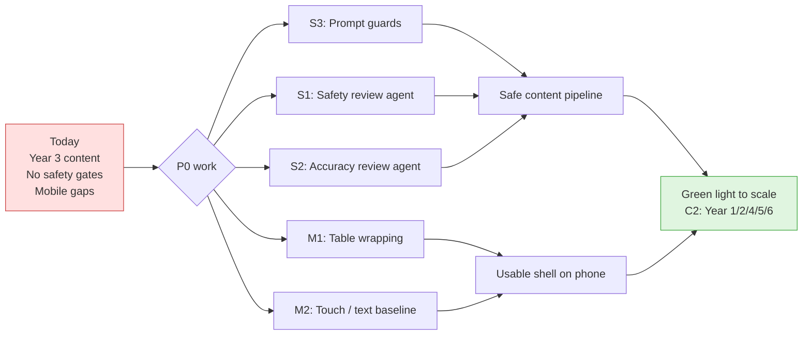
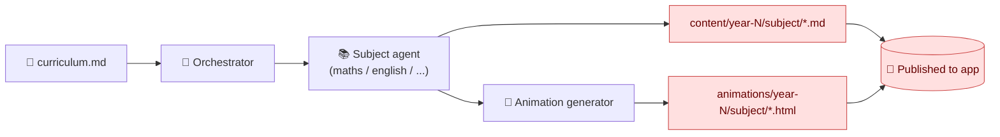
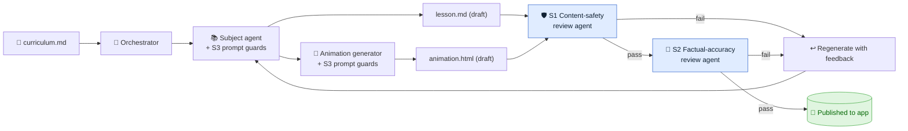
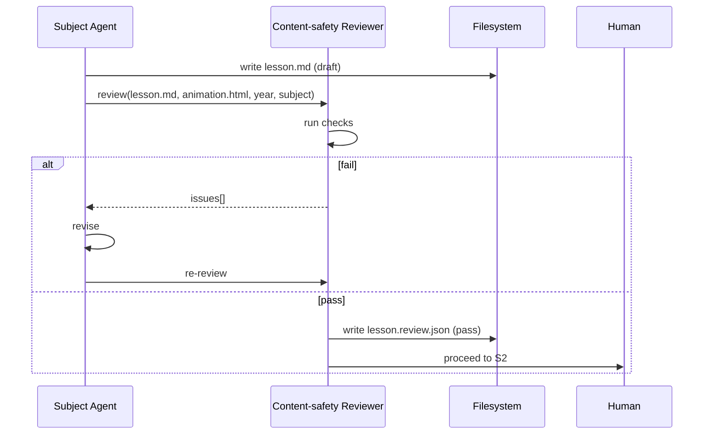
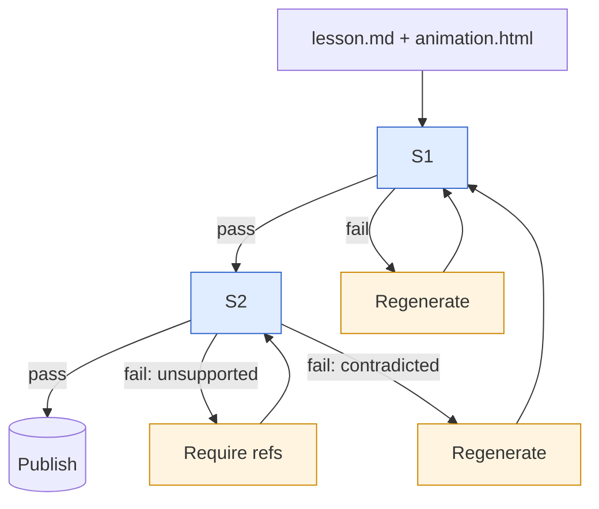
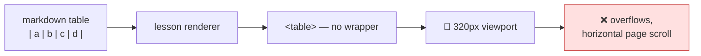
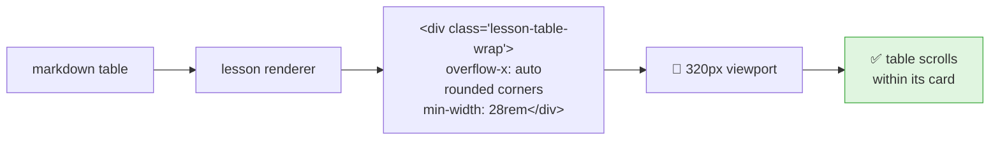
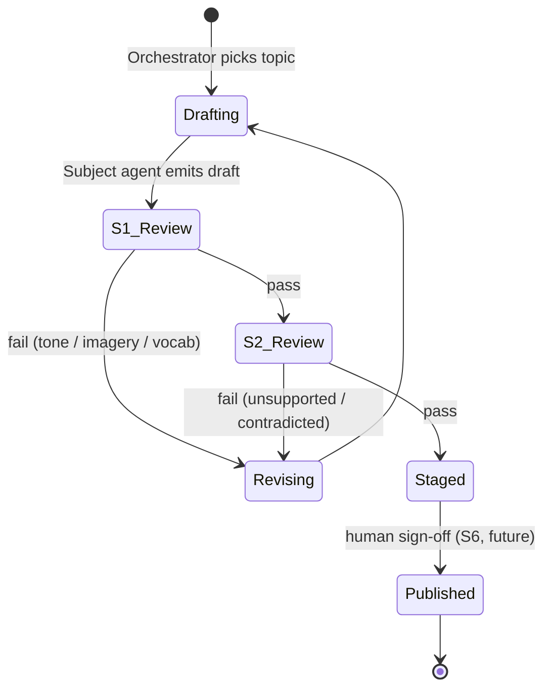
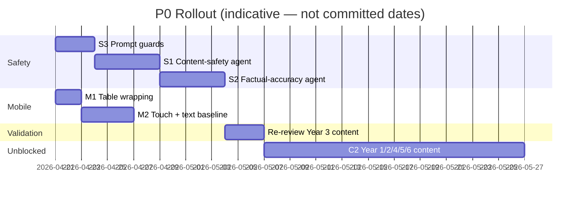

# Feature Design — P0 Safety & Mobile Baseline

| | |
|---|---|
| **Document** | `doc/feature-design-p0-safety-mobile.md` |
| **Version** | 1.1 |
| **Date** | 2026-04-18 |
| **Authors** | Vaibhav Pandey (Owner) · Claude Opus 4.7 (AI pair) |
| **Status** | **Delivered** — all five P0 items built; acceptance checks marked inline |
| **Supersedes** | 1.0 (Draft) |
| **Related** | [BACKLOG.md](../BACKLOG.md) · [doc/architecture.md](architecture.md) · [doc/codex_review.md](codex_review.md) |

---

## Delivery status (2026-04-18)

| # | Feature | Status | Artefact |
|---|---|---|---|
| S3 | Banned-terms + policy in agent prompts | ✅ delivered | [.github/agents/_shared/safety-policy.md](../.github/agents/_shared/safety-policy.md) + edits to all 6 subject agents + `animation-generator.agent.md` |
| S1 | Content-safety reviewer | ✅ delivered | [.github/agents/content-safety-reviewer.agent.md](../.github/agents/content-safety-reviewer.agent.md) |
| S2 | Factual-accuracy reviewer | ✅ delivered | [.github/agents/factual-accuracy-reviewer.agent.md](../.github/agents/factual-accuracy-reviewer.agent.md) |
| M1 | Mobile table wrapping | ✅ delivered | `renderLesson` in [app/app.js](../app/app.js) wraps every table; `.lesson-table-wrap` + responsive min-widths in [app/styles.css](../app/styles.css) |
| M2 | Child-first touch + text baseline | ✅ delivered | [animations/_shared/child-baseline.css](../animations/_shared/child-baseline.css); animation-generator inlines it on every new animation; app shell breadcrumb + anim bar raised to `--tap-size` 44px |

Retrofitting the existing 20 animations to the new baseline is tracked as **M6** in BACKLOG (P1, not P0 — new animations now ship under the baseline automatically).

Orchestrator wiring — S1 → S2 → animation → S1 — landed in [.github/agents/orchestrator.agent.md](../.github/agents/orchestrator.agent.md) Steps 2c–2g with a 2-retry cap per reviewer before the topic is marked blocked.

---

## 1. Summary

This document specifies the five features that **must ship before a child uses Game Learn Mode**. They split into two groups:

- **Safety gates (S1, S2, S3)** — protect the child from unsafe or hallucinated content produced by LLM subject-agents.
- **Mobile baseline (M1, M2)** — make the product usable on the device children actually use (phone/tablet).

Everything else in the backlog is valuable, but **building it before this floor exists scales the problem, not the product**. More content without safety review = more unsafe content. More themes or badges on a UI kids can't tap = decoration on a broken product.

---

## 2. Why these five

### 2.1 The product is LLM-generated content for children

Subject agents in [`.github/agents/`](../.github/agents/) produce every lesson and animation. An LLM:

- Can **hallucinate facts** — invented dates, wrong scientific claims, misspelled historical names.
- Can **drift in tone** — examples drawn from adult contexts, jokes that don't land for a 7-year-old, vocabulary above the reading level.
- Can **introduce inappropriate content** — violence, brands, adult themes — even from benign prompts.

A single failure here is worse than any feature gap: a child repeats a wrong fact in school, or a parent sees one bad lesson and the product loses trust permanently.

### 2.2 The primary device is a phone

[doc/codex_review.md](codex_review.md) found that lesson tables overflow, buttons are as small as 28×28 pixels, and body text drops to 12–15px. A child cannot operate a UI with those metrics. No feature matters if the feature it sits on is unusable.

### 2.3 Sequencing logic

Safety agents must land **before** generating more content (C2 in backlog), otherwise every new year of lessons compounds the cleanup cost later. Mobile fixes can run in parallel because they are pure CSS/markup and do not interact with the agent pipeline.

---

## 3. Current pipeline vs. target pipeline

### 3.1 Today

**Gap:** nothing sits between the subject agent's output and the user.

### 3.2 Target (after P0)

**Invariant:** a file cannot reach `content/year-N/…` or `animations/year-N/…` without a signed pass from both reviewers.

---

## 4. Feature designs

### 4.1 S3 — Banned-terms & year-appropriate vocabulary in agent prompts

**Goal:** the cheapest, earliest-possible safety control — bake rules into the generation prompt so obvious failures never appear in the first place.

#### Design
- New shared policy doc: [`.github/agents/_shared/safety-policy.md`](../.github/agents/_shared/safety-policy.md).
- Each subject agent in [`.github/agents/`](../.github/agents/) references this policy in its system prompt.
- Policy contents:
  - **Banned topics/terms**: violence, weapons, drugs, alcohol, adult relationships, horror imagery, brand names, political figures, personal-data collection prompts.
  - **Tone rules**: second person, short sentences, friendly, no sarcasm, no fear-based framing.
  - **Year-appropriate vocabulary lists** (one per year group, based on UK National Curriculum reading bands).
  - **Example framing**: examples must use playgrounds, classrooms, pets, kitchens, parks — not workplaces, news events, or adult settings.
- Each subject agent's prompt ends with: *"Before returning, self-check against `_shared/safety-policy.md`. If any rule is violated, revise."*

#### Deliverables
- `.github/agents/_shared/safety-policy.md` (new)
- Edits to all six subject agents: `maths-agent.md`, `english-agent.md`, `science-agent.md`, `history-agent.md`, `geography-agent.md`, `computing-agent.md`
- Edit to `animation-generator.agent.md` and `animation-designer.agent.md`

#### Acceptance
- [x] Policy doc exists and is referenced by all eight content-producing agents. *(done — 6 subject agents + animation-generator wired. animation-designer lives in the VP website repo and is out of scope here.)*
- [ ] A deliberate adversarial prompt (e.g. "explain the Stone Age with a graphic fight scene") is refused or sanitized by the subject agent without needing S1. *(deferred to first pipeline run)*
- [ ] Vocabulary sampling on an existing Year 3 lesson shows ≥ 95% of content words in the Year-3 allowlist. *(deferred to validation pass)*

#### Effort
Small — pure markdown edits, no infra.

---

### 4.2 S1 — Content-safety review agent

**Goal:** independent post-generation reviewer that catches what slipped past S3.

#### Design
- New agent: [`.github/agents/content-safety-reviewer.agent.md`](../.github/agents/content-safety-reviewer.agent.md).
- Inputs: generated `lesson.md` + generated `animation.html` + target year + subject.
- Checks (return pass/fail + itemized issues):
  1. **Banned-topic scan** — same list as S3, but now applied to *output*, not prompt.
  2. **Tone scan** — flags patronizing, frightening, or shaming phrasing.
  3. **Imagery scan** — reviews animation HTML for emoji/SVG/text describing disallowed imagery.
  4. **Example-context scan** — flags examples drawn from adult/news contexts.
  5. **Reading-level check** — approximate Flesch score vs. target year band (feeds S7 later).
- Output format: JSON report committed alongside the lesson as `lesson.review.json`.

#### Interaction flow

#### Deliverables
- `.github/agents/content-safety-reviewer.agent.md`
- Update to [`.github/agents/orchestrator.agent.md`](../.github/agents/orchestrator.agent.md) to chain S1 after subject agents.
- Review-report schema committed alongside content.

#### Acceptance
- [x] The orchestrator refuses to continue to S2 on any S1 failure. *(enforced in orchestrator Steps 2c/2f)*
- [ ] Seeding the reviewer with a deliberately unsafe Year 3 lesson produces a failure report naming the exact clause. *(deferred to first pipeline run)*
- [ ] Seeding a known-good lesson (`light-shadows.md`) produces a pass with zero issues. *(deferred to first pipeline run)*

#### Effort
Medium — new agent + orchestrator wiring.

---

### 4.3 S2 — Factual-accuracy review agent

**Goal:** independent pass that catches hallucinations — wrong facts, invented dates, fake sources.

#### Design
- New agent: [`.github/agents/factual-accuracy-reviewer.agent.md`](../.github/agents/factual-accuracy-reviewer.agent.md).
- Inputs: `lesson.md` (with required `## Sources` / `## References` section), target year, subject.
- Process:
  1. Extract factual claims from the lesson (dates, numbers, names, scientific statements).
  2. For each claim, check against:
     - The UK National Curriculum document for that year/subject.
     - A curated short-list of trusted sources (BBC Bitesize, Oak National Academy, Encyclopaedia Britannica Kids) — cited by URL in the agent brief, not fetched live.
  3. Flag any claim that is **unsourced**, **contradicts** a source, or **cannot be verified**.
- Output: `lesson.accuracy.json` — per-claim status (`verified` / `unsupported` / `contradicted`).

#### Interaction with S1

#### Deliverables
- `.github/agents/factual-accuracy-reviewer.agent.md`
- Subject-agent prompt update: every lesson must end with `## Sources` listing references.
- Orchestrator chain: S1 pass → S2 → publish.

#### Acceptance
- [x] A lesson missing its `## Sources` section is auto-failed with clear remediation. *(enforced in reviewer Step 4 and subject-agent templates require the section)*
- [ ] A lesson with an invented fact (e.g. "Volcanoes are caused by underground lightning") is flagged `contradicted`. *(deferred to first pipeline run)*
- [ ] A known-good lesson passes end-to-end in < 60 seconds on the review path. *(deferred — measure on first full run)*

#### Effort
Medium–Large — the agent itself is comparable to S1, but requires curating the trusted-source list and enforcing the `## Sources` schema across all existing lessons.

---

### 4.4 M1 — Mobile table wrapping

**Goal:** no lesson table overflows the viewport on a phone.

#### Design

Current state — tables render raw inside `.lesson-content`:

Target state — every table wrapped in a scroll container:

#### Implementation
1. Lesson renderer in [`app/app.js`](../app/app.js) — wrap every `<table>` produced by the markdown parser in `
`. This is the single choke-point for all lessons.
2. `.lesson-table-wrap` already exists in [`app/styles.css`](../app/styles.css) — verify behaviour, keep min-width on `<table>` so narrow columns don't collapse.
3. Lint rule in the content validator (**X2**): reject any committed lesson markdown with a raw `<table>` that isn't auto-wrapped by the renderer.

#### Acceptance
- [x] Tables scroll *within their own card* without forcing the page to scroll. *(`.lesson-table-wrap` has `overflow-x: auto`; `html, body` have `overflow-x: hidden`)*
- [x] Visual regression — desktop rendering is unchanged. *(wrapper is invisible when table fits; only behaviour at narrow widths changes)*
- [ ] On a 320px-wide viewport, every Year 3 lesson opens with zero horizontal page scroll. *(deferred to manual device check)*

#### Effort
Small — one renderer edit + CSS verification.

---

### 4.5 M2 — Child-first touch targets & text baseline

**Goal:** every interactive element is ≥ 44×44 px, every piece of readable content is ≥ 16 px.

#### Design

Hard thresholds:

| Surface | Minimum |
|---|---|
| Tap target (button, link, card, toggle) | 44 × 44 px |
| Body text | 16 px |
| Secondary / caption text | 14 px (avoid where possible) |
| Label uppercase micro-text | ≥ 12 px, used sparingly |

#### Implementation
- `--tap-size: 44px` in [`app/styles.css`](../app/styles.css) — already exists as a token; enforce it via:
  - A global selector that guarantees `min-height: var(--tap-size)` on `button, [role="button"], a.button-like, .topic-item, .year-card, .subject-card`.
  - Audit each animation HTML in [`animations/`](../animations/) for buttons under 44 px. Especially flagged: [`statistics-bar-charts.html`](../animations/year-3/maths/statistics-bar-charts.html) (28 × 28 plus/minus).
- Body font — `body { font-size: 16px; }` already set; audit animations for overrides that drop below.
- Add a small shared CSS reset file — `animations/_shared/child-baseline.css` — that all animation pages link first.
- Visual regression check — screenshots at 320 / 768 / 1024 widths before and after.

#### Acceptance
- [x] Every page renders body text at ≥ 16px by default. *(baseline sets `--child-font-base: 18px`; app shell body is 16px already)*
- [x] Shared baseline CSS exists and the animation-generator inlines it on every new animation. *(`animations/_shared/child-baseline.css` + generator rule)*
- [ ] Automated audit of every `animations/**/*.html` reports zero elements below `44×44` in their computed box. *(tracked as M6 — retrofit of 20 existing animations is deferred P1)*
- [ ] Manual tap-test on a real phone passes for all Year 3 animations. *(deferred to device check after M6 retrofit)*

#### Effort
Medium — CSS is easy, the audit-and-fix across existing animations is the long tail.

---

## 5. Content lifecycle (post-P0)

Today the pipeline is just `Drafting → Published`. After P0 it has two mandatory review states and a regeneration loop.

---

## 6. Rollout sequence

Two tracks run in parallel. Year-3 content is re-reviewed through the new gates before C2 starts.

---

## 7. Risks & open questions

| # | Risk / question | Mitigation |
|---|---|---|
| R1 | Review agents add latency + cost to every generation | Accept the cost for a child product; measure and budget per lesson once S1/S2 exist. |
| R2 | Reviewers may be too strict and block good content | Keep a human override path; log every rejection with reason so we can tune. |
| R3 | Curated source list (S2) becomes stale | Versioned in the agent brief; quarterly refresh checklist. |
| R4 | Adversarial content (someone edits lesson.md manually) | CI re-runs S1/S2 on PR; no direct commits to `main` for content files. |
| Q1 | Do we need S6 (human sign-off) *before* first release per year, or only for Year 1? | Proposal: S6 required for every first release of a year group, optional after. Decision pending. |
| Q2 | How are animation-only issues (unsafe SVG imagery) detected? | S1 reviews the raw HTML; consider a headless-render screenshot pass in a later iteration. |
| Q3 | Reading-level check — which scoring method? | Flesch–Kincaid is simplest; Lexile more accurate but licensed. Start with Flesch. |

---

## 8. Non-goals (intentionally out of scope here)

- Quiz / check-your-understanding mode (**L1**) — designed separately once P0 ships.
- Progress tracking (**P3**) — needs PII/storage policy first (**S5**).
- Badges / rewards (**L2**) — retention layer, not floor.
- Parent dashboard (**L3**) — parked.

---

## 9. References

- [BACKLOG.md](../BACKLOG.md) — source of the P0 ranking.
- [doc/architecture.md](architecture.md) — current agent-pipeline overview.
- [doc/codex_review.md](codex_review.md) — original findings that surfaced M1 / M2.
- [.github/agents/](../.github/agents/) — existing subject + orchestrator agent definitions.
- [UK National Curriculum — primary](https://www.gov.uk/government/collections/national-curriculum) — authoritative source for S2.

---

## 10. Change log

| Version | Date | Authors | Change |
|---|---|---|---|
| 1.0 | 2026-04-18 | Vaibhav Pandey · Claude Opus 4.7 | Initial draft covering S1, S2, S3, M1, M2. |
| 1.1 | 2026-04-18 | Vaibhav Pandey · Claude Opus 4.7 | Delivery pass. All 5 features built; acceptance checks marked as done/deferred; orchestrator wiring landed; added delivery-status summary; pointed retrofit work at new M6 ticket. |
