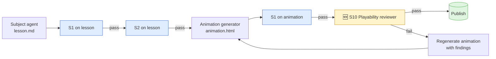

# Feature Design — S10 Game-Playability Reviewer

| | |
|---|---|
| **Document** | `doc/feature-design-s10-playability.md` |
| **Version** | 1.1 |
| **Date** | 2026-04-18 |
| **Authors** | Vaibhav Pandey (Owner) · Claude Opus 4.7 (AI pair) |
| **Status** | **Delivered** — agent built, orchestrator wired, awaiting first pipeline run for acceptance |
| **Related** | [BACKLOG.md](../BACKLOG.md) (S10) · [feature-design-p0-safety-mobile.md](feature-design-p0-safety-mobile.md) · [.github/agents/playability-reviewer.agent.md](../.github/agents/playability-reviewer.agent.md) · [.github/agents/animation-generator.agent.md](../.github/agents/animation-generator.agent.md) |

---

## 1. Summary

S10 adds a **third reviewer** to the generation pipeline that judges animations on *child-playability*, not safety or factual accuracy. It answers one question: **can a child in the target year actually play this in 30 seconds without adult help?**

S1 (safety) and S2 (accuracy) already stop unsafe or wrong content from reaching the child. Neither of them stops a correct, safe, but unplayable game — e.g. a Year 1 animation with seven on-screen controls, three written instructions, and no clear "what do I tap first?". That is the gap S10 fills.

---

## 2. Why a separate reviewer

### 2.1 S1 and S2 are not the right lens

S1 judges language/imagery against a ban list. S2 verifies facts against sources. A game can pass both and still be unplayable: right facts, safe tone, and a UI a child can't parse.

### 2.2 Playability is a design concern, not a content concern

Playability depends on screen density, verbal instruction load, number of rules, visual affordance, feedback latency, and failure-state kindness. The subject agent doesn't think about any of those — it thinks about the concept. The animation-generator thinks about archetypes, but has no second pair of eyes.

### 2.3 The cost of getting this wrong

A child who bounces off a game once rarely comes back to it. The product's entire value hinges on kids choosing to play; an unplayable game is worse than no game.

---

## 3. Where S10 sits in the pipeline



S10 runs **after S1 on the animation** — safety first, playability second. If S10 fails, the orchestrator re-dispatches the animation-generator with S10 findings (same pattern as S1/S2 rework loops).

---

## 4. Playability rubric

Rubric is expressed as **year-scaled checks**. The same animation is judged against a different bar depending on the target year.

| # | Check | Y1–2 bar | Y3–4 bar | Y5–6 bar |
|---|---|---|---|---|
| P1 | **Rules count** — distinct rules the child must hold in mind at once | ≤ 2 | ≤ 3 | ≤ 4 |
| P2 | **On-screen interactive items** (at any single moment) | ≤ 5 | ≤ 8 | ≤ 12 |
| P3 | **Reading load for the core loop** — words the child must read to play | ≤ 10 | ≤ 25 | ≤ 50 |
| P4 | **Obvious first action** — within 3 seconds a child can tell what to tap first | required | required | required |
| P5 | **Tap target size** — every interactive element meets the `--tap-primary` (56px) or `--tap-min` (44px) floor from [child-baseline.css](../animations/_shared/child-baseline.css) | 56px | 44px | 44px |
| P6 | **Instructions** — zero or one instruction line at the top; no modal walls of text | 1 line | ≤ 2 lines | ≤ 3 lines |
| P7 | **Feedback kindness** — on wrong answer, no shaming language; always offers a next try | required | required | required |
| P8 | **Feedback clarity** — correct/incorrect signalled by colour + icon + text (not colour alone) | required | required | required |
| P9 | **Failure state** — no "game over" that blocks the child from continuing; infinite retries | required | required | required |
| P10 | **Time-to-first-interaction** — child can interact within ~3 seconds of load (no cutscene) | required | required | required |
| P11 | **Motion load** — no flashing > 3 Hz; respects `prefers-reduced-motion` | required | required | required |
| P12 | **Reward loop** — some positive signal (bounce, colour burst, score tick) on correct action | required | required | required |

### How S10 measures each check

| Check | Measurement method |
|---|---|
| P1 rules | Static read of the `<script>` block + header instruction text. Reviewer counts distinct player rules it can identify. |
| P2 items | Count of `<button>`, `[role="button"]`, `[draggable]`, `.option`, and other interactive nodes in the initial DOM. |
| P3 reading | Word count of visible text in `<header>`, `.instruction`, `.prompt`, and primary controls. |
| P4 first action | Inspection: does exactly one primary control stand out (size, colour, position)? Heuristic — bigger, more saturated, or explicitly labelled `.primary`/`.primary-tap`. |
| P5 tap size | Parse CSS; confirm every interactive selector inherits or overrides `--tap-min` / `--tap-primary`. |
| P6 instructions | Count lines in instruction region. |
| P7 kindness | Scan feedback string literals in JS for banned phrases (`wrong`, `failed`, `no`, `try harder`) and require at least one kind phrase (`try again`, `nearly`, `have another go`). |
| P8 clarity | Check that feedback DOM has text + icon classes (`.feedback--ok`/`.feedback--bad` from baseline), not just a colour change. |
| P9 no-block | No `game-over` screen that requires a refresh; retries are always reachable. |
| P10 first-interaction | Check for splash screens, cutscenes, `setTimeout` before first interactive render. |
| P11 motion | Grep for `animation-duration`, `@keyframes` iteration counts; confirm `prefers-reduced-motion` guard exists. |
| P12 reward | Presence of a positive visual effect class (e.g. `.bounce`, `.flash-ok`) triggered on correct state. |

S10 does not need to *run* the animation — it reads the HTML/CSS/JS statically, the same way S1 and S2 do.

---

## 5. Agent spec

New file: `.github/agents/playability-reviewer.agent.md`

```yaml
---
name: Game Playability Reviewer
description: "Reviewer (S10). Audits a generated animation HTML on child-playability against a year-scaled rubric. Called by the orchestrator after S1 passes on the animation. Never edits files — only reports PASS, FAIL, or BLOCKED."
tools: [read, todo]
argument-hint: "Provide target_file (animations/...), subject, and year."
user-invocable: false
---
```

### Review procedure
1. Read [`animations/_shared/child-baseline.css`](../animations/_shared/child-baseline.css) — understand the baseline tokens the animation should inherit.
2. Read `target_file` in full (HTML, style, script).
3. Run every rubric check P1–P12 with the year-appropriate bar.
4. For each: ✅ / ⚠️ / ❌ with a specific reason and line reference.
5. Decide verdict:
   - **PASS** — all required checks ✅; ≤ 1 ⚠️ on soft checks (P1–P3 thresholds).
   - **FAIL** — any ❌ on a required check, or ≥ 2 ⚠️ on thresholds.
   - **BLOCKED** — archetype fundamentally wrong for year (rare; typically means animation-generator picked an archetype beyond the child's capability — escalate).

### Report format

```
S10 VERDICT: {PASS | FAIL | BLOCKED}
file: {target_file}
subject: {subject}
year: {year}

Rubric:
- P1 rules count: {count} vs bar {N} — {✅ / ⚠️ / ❌}
- P2 on-screen items: {count} vs bar {N} — {...}
- P3 reading load: {count words} vs bar {N} — {...}
- P4 obvious first action: {✅ / ❌ with reason}
- P5 tap size: {✅ / ❌ with specific undersized selector}
- P6 instructions: {count lines} — {...}
- P7 kindness: {✅ / ❌ with quoted offending string}
- P8 clarity: {...}
- P9 failure state: {...}
- P10 time-to-interaction: {...}
- P11 motion: {...}
- P12 reward loop: {...}

Findings:
- [line {n}] {specific issue, what to change}

Decision rationale:
{2–4 sentences. Lead with the most severe check.}

Next action:
- PASS: "Publish animation."
- FAIL: "Return to animation-generator with findings. Simplify per Year {year} bar."
- BLOCKED: "Escalate — archetype mismatch for Year {year}."
```

---

## 6. Orchestrator change

In [`.github/agents/orchestrator.agent.md`](../.github/agents/orchestrator.agent.md) Step 2f (currently S1 on the animation), add Step 2g:

- **2f** — S1 on animation (existing)
- **2g (new)** — S10 on animation
- **2h** — mark todo done only if 2f + 2g both PASS

Retry cap: 2 (same as S1/S2). On 3rd S10 failure, mark topic `blocked-playability` and move on.

---

## 7. Acceptance

- [x] `.github/agents/playability-reviewer.agent.md` exists and is callable by the orchestrator.
- [x] Orchestrator chains S1 → S10 on every animation; publish is blocked without both. *(Step 2g, with re-run-S1-after-simplification guard per Hard Rule 9)*
- [x] Pipeline report includes S10 pass/fail/blocked counts. *(Step 4 summary updated)*
- [ ] Seeding a known-busy animation (many buttons, dense text) at Year 1 produces FAIL with specific rule citations. *(deferred to first pipeline run)*
- [ ] Seeding [counting-to-100.html](../animations/year-1/maths/counting-to-100.html) (the gold-standard reference, per C3) produces PASS. *(deferred to first pipeline run)*

---

## 8. Risks & open questions

| # | Risk / question | Mitigation |
|---|---|---|
| R1 | Static analysis can't catch all playability issues (e.g. visual layout that looks crowded but passes item count) | Accept static-only v1; add a `prefers-reduced-motion + screenshot` pass in a later iteration. |
| R2 | Thresholds in §4 are guesses, not user-tested | Tune after first cohort of real Year 1 / Year 3 play-tests. |
| R3 | S10 adds latency + LLM cost to every animation | Accept; animation generation is the longer-pole cost. |
| Q1 | Should S10 also apply to the main app shell (topic list pages)? | Out of scope v1. App shell is not agent-generated. If we add child-mode screens later, revisit. |
| Q2 | Should P7 banned-phrase list be in the shared safety policy or here? | Keep kind-feedback rules here — they are playability, not safety. Shaming *is* a safety issue and is already in safety-policy §3; S10 reinforces the positive requirement. |

---

## 9. Non-goals

- **Adaptive difficulty** — L5 in the backlog, depends on P3 progress-tracking. S10 judges a single artefact against a fixed year bar, not per-child tuning.
- **A11y full audit** — S10 does tap-size, motion, and colour+icon; full WCAG 2.2 is a bigger separate pass.
- **Live/dynamic behaviour** — static-only review; any bug that only appears after 20 seconds of play is out of scope for v1.

---

## 10. Change log

| Version | Date | Authors | Change |
|---|---|---|---|
| 1.0 | 2026-04-18 | Vaibhav Pandey · Claude Opus 4.7 | Initial draft — rubric, agent spec, orchestrator placement, acceptance. |
| 1.1 | 2026-04-18 | Vaibhav Pandey · Claude Opus 4.7 | Delivery pass. Agent file created, orchestrator Step 2g added, Hard Rule 9 ensures S1 re-runs after any S10-driven simplification. Acceptance: 3/5 items ticked; 2 deferred to first Year-3 `--force` run through the new gate. |
